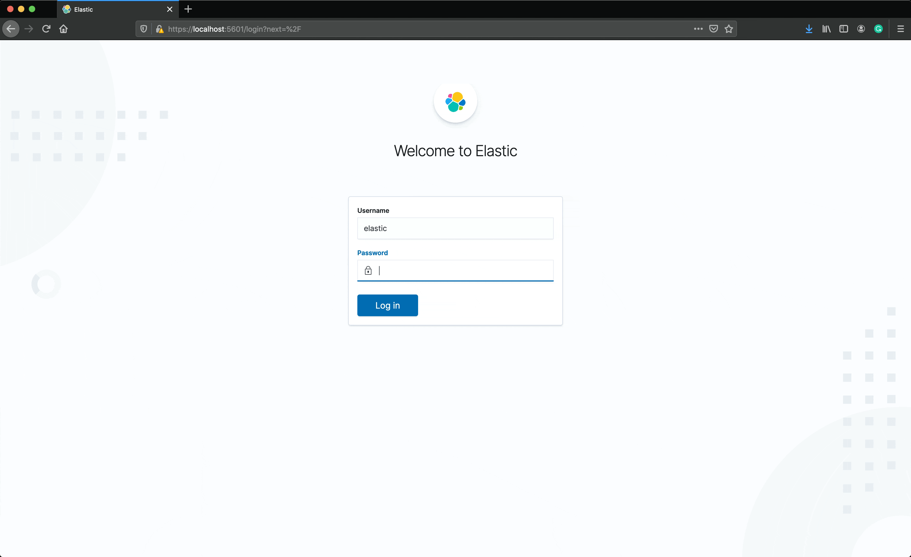

# Step 5: Logging

In this step, we will add a logging platform and forward our application logs to it. 

## Goals

* Install and configure Elastic, Kibana, and Fluentd on Kubernetes.
* View application logs through Kibana.

## Tasks

#### Create a new namespaces for logging components

```bash
$ kubectl create ns logging
namespace/logging created
```

#### Deploy ECK (Elastic Cloud on Kubernetes)

First, we will deploy the Elastic operator (ECK) on Kubernetes (ref: [Elastic docs](https://www.elastic.co/guide/en/cloud-on-k8s/current/k8s-deploy-eck.html)).

```bash
$ kubectl apply -f https://download.elastic.co/downloads/eck/1.2.1/all-in-one.yaml
customresourcedefinition.apiextensions.k8s.io/apmservers.apm.k8s.elastic.co created
customresourcedefinition.apiextensions.k8s.io/beats.beat.k8s.elastic.co created
customresourcedefinition.apiextensions.k8s.io/elasticsearches.elasticsearch.k8s.elastic.co created
customresourcedefinition.apiextensions.k8s.io/enterprisesearches.enterprisesearch.k8s.elastic.co created
customresourcedefinition.apiextensions.k8s.io/kibanas.kibana.k8s.elastic.co created
namespace/elastic-system created
serviceaccount/elastic-operator created
secret/elastic-webhook-server-cert created
clusterrole.rbac.authorization.k8s.io/elastic-operator created
clusterrole.rbac.authorization.k8s.io/elastic-operator-view created
clusterrole.rbac.authorization.k8s.io/elastic-operator-edit created
clusterrolebinding.rbac.authorization.k8s.io/elastic-operator created
rolebinding.rbac.authorization.k8s.io/elastic-operator created
service/elastic-webhook-server created
statefulset.apps/elastic-operator created
validatingwebhookconfiguration.admissionregistration.k8s.io/elastic-webhook.k8s.elastic.co created
```

#### Deploy Elastic

Now we can use the ECK operator to create an Elastic cluster.

```yaml
apiVersion: elasticsearch.k8s.elastic.co/v1
kind: Elasticsearch
metadata:
  name: kubecon
  namespace: logging
spec:
  version: 7.9.2
  nodeSets:
    - name: default
      count: 1
      podTemplate:
        spec:
          containers:
            - name: elasticsearch
              env:
                - name: ES_JAVA_OPTS
                  value: -Xms1g -Xmx1g
              resources:
                requests:
                  memory: 1Gi
                limits:
                  memory: 1Gi
```

Apply this configuration to the cluster:

```bash
$ kubectl apply -f elastic.yaml
elasticsearch.elasticsearch.k8s.elastic.co/kubecon created
```

Make sure the cluster is healthy:

```bash
$ kubectl get elasticsearch -n logging
NAME      HEALTH   NODES   VERSION   PHASE   AGE
kubecon   green    1       7.9.2     Ready   6m54s
```

#### Deploy Kibana

```yaml
apiVersion: kibana.k8s.elastic.co/v1
kind: Kibana
metadata:
  name: kubecon
  namespace: logging
spec:
  version: 7.9.2
  count: 1
  elasticsearchRef:
    name: kubecon
```

Apply this configuration to the cluster:

```bash
$ kubectl apply -f kibana.yaml
kibana.kibana.k8s.elastic.co/kubecon create
```

Make sure all components have come up and are healthy

```bash
$ kubectl get kibana -n logging
NAME      HEALTH   NODES   VERSION   AGE
kubecon   green    1       7.9.2     79s
```

#### Log in to the Kibana instance

First, get the password from the secret for our Elastic user:

```bash
kubectl get secret -n logging kubecon-es-elastic-user -o go-template='{{.data.elastic | base64decode}}'
```

Port-forward the Kibana service so we can access it locally:

```bash
$ kubectl port-forward -n logging service/kubecon-kb-http 5601
Forwarding from 127.0.0.1:5601 -> 5601
Forwarding from [::1]:5601 -> 5601
```

Go to https://localhost:5601 in your browser and log in using the `elastic` user and the password from above.

We won't be able to see any data because we haven't started forwarding logs to elastic yet!



#### Forward application logs with Fluentd

Next, we need to deploy Fluentd as a daemonset and configure it to forward all logs to Elastic.

Create the fluentd daemonset:

```bash
$ kubectl apply -f fluentd.yaml
clusterrole.rbac.authorization.k8s.io/fluentd created
clusterrolebinding.rbac.authorization.k8s.io/fluentd created
serviceaccount/fluentd created
daemonset.apps/fluentd created
```

Make sure fluentd is running:

```bash
$ kubectl get ds fluentd -n logging
NAME      DESIRED   CURRENT   READY   UP-TO-DATE   AVAILABLE   NODE SELECTOR   AGE
fluentd   1         1         1       1            1           <none>          17s
```

#### Create logging index in Kibana

Go back to the Kibana UI at https://localhost:5601.
Then navigate to "Discover" under "Kibana" and configure an index
so that we can search logs as shown below.


Now we can search application logs!
Try this KQL query to see all logs from the `api` service:

```bash
kubernetes.labels.app : "api"
```
