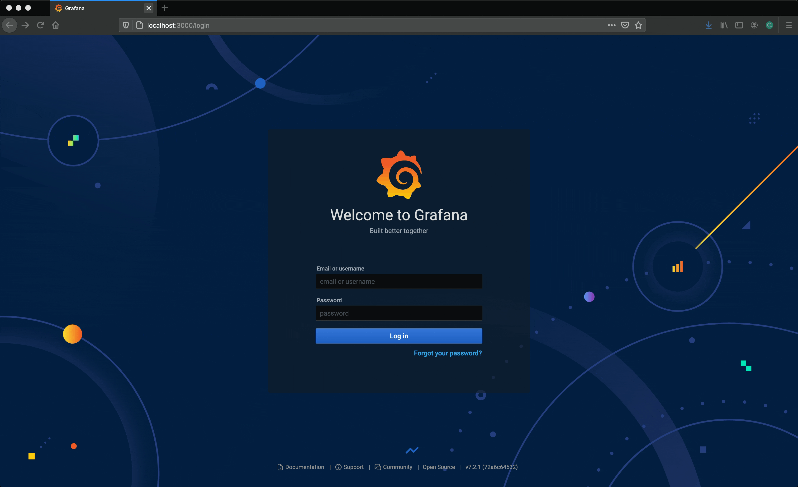
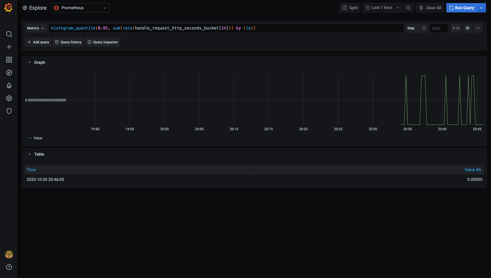

# Step 6: Metrics

In this step, we will add a logging platform and forward our application logs to it. 

## Goals

* Install Prometheus
* Install Grafana
* Modify application configuration so that prometheus could scrape metrics
* Look at app metrics in Grafana

## Tasks

### Create a namespace for metrics components

```bash
$ kubectl create ns metrics
namespace/metrics created
```

### Install Prometheus using the Helm chart

```bash
helm repo add prometheus-community https://prometheus-community.github.io/helm-charts
helm repo add stable https://kubernetes-charts.storage.googleapis.com/
helm install prometheus prometheus-community/prometheus -n metrics --create-namespace
```

Make sure everything is running:

```bash
$ kubectl get pods -n metrics
NAME                                            READY   STATUS    RESTARTS   AGE
prometheus-alertmanager-64bf78d458-bv86m        2/2     Running   0          87s
prometheus-kube-state-metrics-95d956569-4zkc8   1/1     Running   0          87s
prometheus-node-exporter-vjjss                  1/1     Running   0          87s
prometheus-pushgateway-69ccbfb9b8-sz822         1/1     Running   0          87s
prometheus-server-bc989b599-6rdrz               2/2     Running   0          87s
```

### Install Grafana usisng the Helm chart

```bash
helm repo add grafana https://grafana.github.io/helm-charts
helm install grafana grafana/grafana -n metrics
```

Note the password in the output of `helm install` above.
You will need to it to login to Grafana.

### Add Prometheus datasource to Grafana

First, port-forward Grafana service so we can reach it locally.

```bash
$ kubectl port-forward -n metrics svc/grafana 3000:80
Forwarding from 127.0.0.1:3000 -> 3000
Forwarding from [::1]:3000 -> 3000
```

Note the service name of the Prometheus server (it should be `prometheus-server`):

```bash
$ kubectl get svc -n metrics
NAME                            TYPE        CLUSTER-IP      EXTERNAL-IP   PORT(S)    AGE
grafana                         ClusterIP   10.96.174.225   <none>        80/TCP     110s
prometheus-alertmanager         ClusterIP   10.96.183.194   <none>        80/TCP     3m52s
prometheus-kube-state-metrics   ClusterIP   10.96.181.90    <none>        8080/TCP   3m52s
prometheus-node-exporter        ClusterIP   None            <none>        9100/TCP   3m52s
prometheus-pushgateway          ClusterIP   10.96.134.255   <none>        9091/TCP   3m52s
prometheus-server               ClusterIP   10.96.210.0     <none>        80/TCP     3m52s
```

Next, go to `http://localhost:3000` in your browser
and add Prometheus as the datasource as shown below.
Once added, we should be able to see Kubernetes metrics.



### Scrape metrics from the api service

**NOTE:** We've programmed our API service to output prometheus metrics. Your application won't automatically output metrics in this format. If you are not already outputting metrics, then prometheus is a great format to start outputting in. If you're already outputting metrics, then we suggest continuing with that format whie you migrate to Kubernetes. After you've migrated, you might look at changing the output format.

First, enable the metrics endpoint on the `api` service
by setting `METRICS_ENABLE_PROMETHEUS` to `true` in the deployment.yaml.

```yaml
env:
  - name: METRICS_ENABLE_PROMETHEUS
    value: "true"
```

Next, to scrape metrics, provide Prometheus pod annotations:

```yaml
annotations:
  prometheus.io/scrape: "true"
  prometheus.io/path: /metrics
  prometheus.io/port: "80"
```

The resulting `deployment.yaml` will look like this:

```yaml
apiVersion: apps/v1
kind: Deployment
metadata:
  name: api
  labels:
    app: api
spec:
  replicas: 1
  selector:
    matchLabels:
      app: api
  template:
    metadata:
      labels:
        app: api
      annotations:
        prometheus.io/scrape: "true"
        prometheus.io/path: /metrics
        prometheus.io/port: "80"
    spec:
      containers:
        - name: api
          image: docker.io/lkysow/api:v0.1.0
          env:
            - name: METRICS_ENABLE_PROMETHEUS
              value: "true"
          ports:
            - containerPort: 80
```

Next, apply this configuration to the cluster:

```bash
$ kubectl apply -f deployment.yaml
deployment.apps/api configured
```

Verify that we can see app metrics now.
Go back to the Grafana UI and run the following query to see response time
for the 95th percentile:

```
histogram_quantile(0.95, sum(rate(handle_request_http_seconds_bucket[1h])) by (le))
```



## Conclusion

We can now see our application metrics in Grafana through Prometheus.

## Next Step

Go to [7-migration](../7-migration/README.md).
