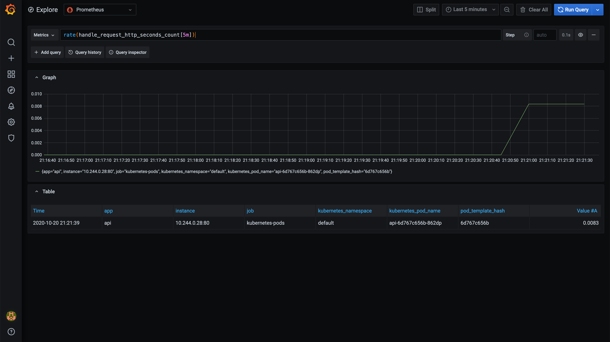

# Step 7: Migration

In this step, we will make the web service talk to the API service on Kubernetes.
We will do so with zero-downtime and without making any changes to the running web service.

## Goals

* Switch the web service talk to the api service on Kubernetes without downtime.

## Tasks

### Switch local DNS

At this point, we still have our `api-vm` service running locally.
Confirm that `web` is still talking to the `api-vm` by going to http://localhost:8080.

To perform the switch with zero-downtime, we will mimic using DNS by changing the
`api`'s service IP in `/etc/hosts`,
similarly to how we did it in step 1.

Currently, our `/etc/hosts` file points at `127.0.0.1`, which is the IP the
`api-vm` service binds to.

`api-k8s` service is exposed via Kubernetes ingress which is bound to `0.0.0.0`.
As long as we point `api` at an IP other than `127.0.0.1`,
but the one our machine understands, it should go to the ingress IP, i.e. `0.0.0.0`.
We will point `api` at `::1` (ipv6 IP for `localhost`).

Open the `/etc/hosts` file:

```bash
sudo vim /etc/hosts
```

Modify the line that points to `api` service and change it to `::1`:

```bash
::1 api
```

### Verify

First, go to http://localhost:8080/ui again and confirm that the `web` service is now talking to the `api-k8s` service instead.

Second, go to the Grafana UI and check the request rate of the API service by running
`rate(handle_request_http_seconds_count[5m])` query.
(refresh the `http://localhost:8080/ui` page a few times to generate more metrics).



## Conclusion

We have migrated our API service to Kubernetes with zero downtime!

## Next Step

Go to [8-consul](../8-consul/README.md).